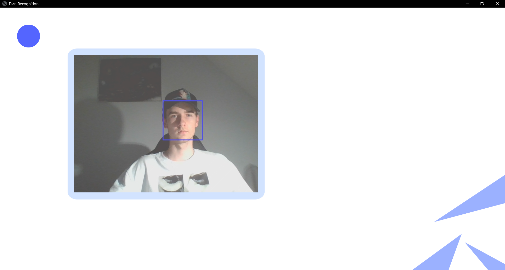
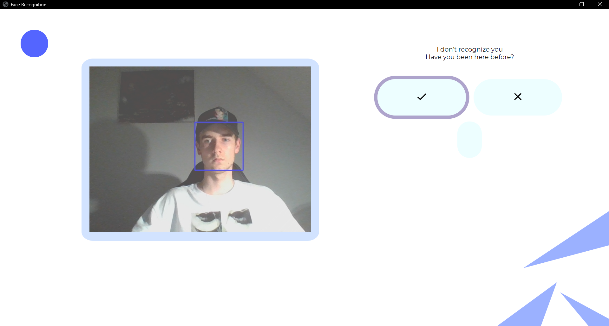
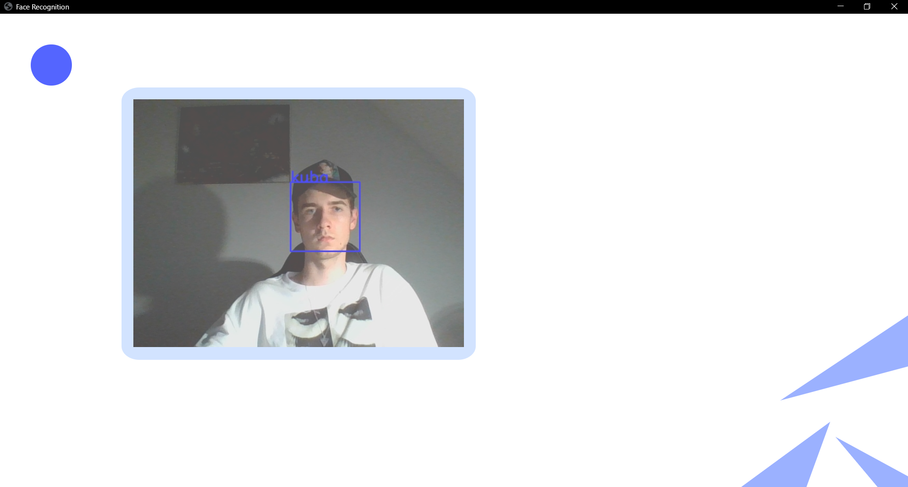

# Python Recognition With OpenCV

  

## Description

---

This is a Face Recognition Application that can learn new faces in runtime.  
## First Usage

---

First run it shouldn't recognize you as the only person in database is Elon Musk, (keep in mind that resources folder cannot be empty so leave it there) so if you aren't very similar to him, you should be good to go :)

At this point you should see a blue rectangle pointing at your face.
  

  
  
After a specified delay time, without recognizing anyone, it will ask you if you are a person that it hasn't seen before. Press the **checkmark** for **yes** and the **x sign** for **no**.
  

  
Then **write down your name** as the directory your images will be stored in (under the 'resources' folder) will be named after that.
  

  

Then the recognizer will update and as of now it will recognize you. You should then stay in this position for a moment so the application can take some more photos of you. (it should know your name) If it ever doesn't recognize you then press when asked about being a new person and write down the name you put there the first time.
  

## Every Next Usage

---

Every next usage it should without a problem recognize you and display your name on the screen. If you want you can go and manually create a new directory under the resources folder, name it as you wish and paste their a couple images of a person you would like the application to recognize.

## Downloading

---

- git clone this repository
- cd/touch facerecognitionpy
- now you can run it with:  
  _for that you need to have poetry installed, I wrote how to install it in my repository called skstyle_bot_  
  **for safety start with poetry install --no-dev**

          poetry run main

- the other way is to simply:  
  _for this one you might want to start a new virtual environment_

          pip install pillow
          pip install eel
          pip install opencv-python
          pip install opencv_contrib_python
          python -m facerecognitionpy

## Other commands

---

- deafult opnecv conf level is set to 70 - 95, you can change it with: (lowering the minimum or amplifing the maximum will result in the application recognizing faces more frequently[sometimes too frequently])

        poetry run change_conf

- delay value is how many times does the application have to recognize your face without it recognizing anyone else for it to add a new photo of you, default is set to 300, you can change it with:

        poetry run change_delay
