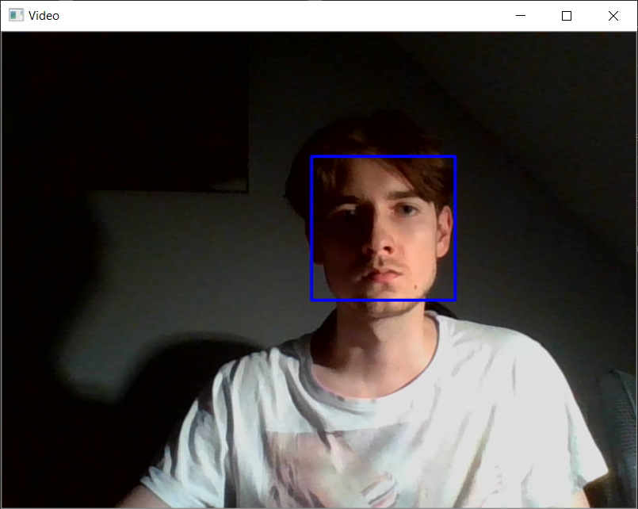
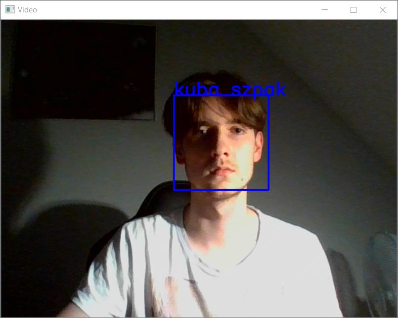

# Python Recognition With OpenCV

## Description
This is a Face Recognition Application that can learn new faces in runtime.  

## First run
---
First run it shouldn't recognize you as the only person in database is Elon Musk, (keep in mind that resources folder cannot be empty so leave it there) so if you aren't very similar to him, you should be good to go :)  
 
At this point you should see a plain blue rectangle    

  

After a specified delay time, without recognizing anyone, it will ask you if you are a person that it hasn't seen before. Press y for yes and Enter. Then write down your name as the directory, your images will be kept in (under the 'resources' folder). Then the recognizer will update and as of now it will recognize you. You should then stay in this position for a moment so the application can take some more photos of you. (it should know your name) If it ever doesn't recognize you then press no when asked about being a new person and write down the name you put there the first time.

## Usage Afterwards
---

Every next usage it should without a problem recognize you and display your name on the screen. If you want you can go and manually create a new directory under the resources folder, name it as you wish and paste their a couple images of a person you would like the application to recognize.

## Interaction in command line

## Downloading
---
- git clone this repository
- cd/touch facerecognitionpy
- now you can run it with poetry run main (for that you need to have poetry installed, I wrote how to install it in my repository called skstyle_bot)  
- the other way is to simply:

        for this one you might want to start a new virtual environment

     - pip install selenium
     - python -m facerecognitionpy
     
